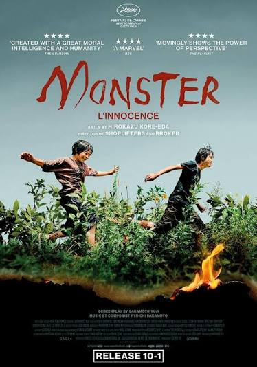
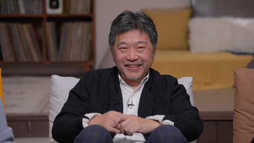
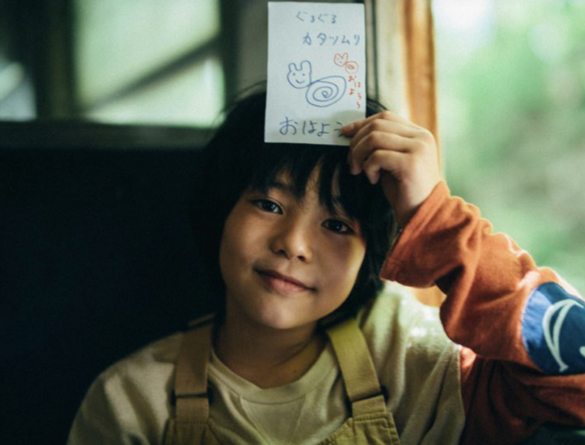

A while ago I recommended _Monster_ (2023, dir. Kore-eda Hirokazu) to my friend Preyas. He watched it and left comments the whole way through, and his reactions were so fun that I couldn't stop replying to them one by one. Before I knew it, our back-and-forth had turned into this. Here it is, mostly untouched: his live reactions, my replies underneath, and the little side conversations we ended up having in the margins.

_A note on format: each top-level point is Preyas reacting live as he watched. The indented line under it is me replying. The quoted blocks are the side conversations we had in the document's margins._

---

## Part 1

- cake smaller again = money tight
  - Lol

- Japanese believe in reincarnation too?
  - It depends on the person. Japan was also influenced by Buddhism, so some people do believe in reincarnation or rebirth. But nowadays, not many people strongly believe in religion compared to the past.

- "I'll hang in there until you get married" = mom depressed too??
  - To her, getting married and starting a family represents a complete, normal life. So once he reaches that point, she might feel like she's done her job as a mom.

- Bullied by teacher that goes to a hostess bar? Wtf is a hostess bar
  - lol 2222

- No one in school taking the report seriously. Why's mom so chill in school?? Let the principal come, do their job../ fk the teacher's apology. Misunderstanding? fire his ass. Why they protecting him? / why are the school staff like robots?????
  - mom's POV

- mom being way too polite
  - Japanese people tend to care a lot about looking polite. Even when people are complaining in public, it's seen as the right way to stay polite and appeal calmly instead of blowing up, so they don't ruin the mood. But I think the director kinda exaggerated the misunderstandings to make that frustration hit harder in this movie.

> **Preyas:** maybe this is social commentary

- why granny trip the kid. Wtf is going on lmao. Why she smile after getting caught? Fake ass
  - I found this in a movie review, and it stuck with me:
    > "Searching for the monster is meaningless. This is because everyone behaves a little strangely, almost like a monster. The principal, unable to overcome the grief of losing her granddaughter, trips a passing girl by the foot, and Saori demands excessive normalcy from Minato. The homeroom teacher Michitoshi constantly says things that begin with 'Be a man,' and the adults in the neighborhood believe the rumors going around without any resistance. In this way, the adults, who have somewhat strange, or grotesque, sides to them, lead the audience to distinguish which side they belong to, good or evil, and in doing so instead obscure the children's truth. Before we can fully understand what wounds the two children carry and what kind of help they need from the adults, the film makes us curious only about whether the school violence is true or not. The audience's impatience to simply and quickly examine the relationship between good and evil is the mistake the film intends the audience to make. And from the point of recognizing their own mistake, the audience comes to understand why _Monster_ needed its three-part structure with different perspectives."
  - Based on this article above, my take is that the film doesn't really explain every weird detail one by one to clear up the strange moments. It kind of leaves that up to the audience. So this movie is asking us, "After seeing this, do you think this principal is a monster?".. Like that.

> **Preyas:** Interesting. Reminds me of what the Principal told Minato at the end. Something about "is it really happiness if everyone can't have it"? Because she lost her granddaughter and is unhappy, she tripped the kid because why should the kid be happy. Sounds ridiculous but so is tripping a random kid. Jena said this is a very Japanese thing so maybe again this is some kind of social commentary from the director to the Japanese audience.
>
> **Me:** I remember seeing YouTube shorts about that issue. I thought it was a recent thing, but apparently it's been a social problem since the 2010s. Totally makes sense now.

---

## Part 2

- so stupid wym they hiding the truth because kid can't go to middle school if he's a bully? So hide that from his mom and do nothing about it? Wtf is this
  - Lol. I've heard about this kind of thing happening a lot in Korea too. Schools don't want things to blow up, they're scared of complaints from parents, and they just want to cover it up and hope it quietly goes away.

> **Preyas:** That's terrible. Putting the staff's comfort (avoiding confrontation with parents) above the wellbeing of the children.
>
> **Me:** There's a bit more context behind that. In Korea, which middle school, high school, and university you get into is extremely important. So if there's even a small mark or flaw in a student's school record, parents can go crazy about it. Recently there was even a case where a teacher died by suicide after being overwhelmed by parents' complaints, so it's become a serious social issue. I think Japan might have something similar.

- rehearsing the apology instead of just being honest is so stupid
  - agree

- why is this dad drunk judging the teacher and automatically thinking his kid's causing problems. Huh?? Pig brain mention!
  - Cuz he's BS

> **Preyas:** When I was watching, this scene made me sympathize with Yori and made me think the dad was the monster. But I also thought Yori became psychopath because of this so I was still way off.

- I hate everyone in this movie
  - Lol 3333
  - I saw an interesting comment in some movie reviews. It said that maybe the reason Yori or Minato lied about teacher Hori was because, from the kids' point of view, he was a good person. So they might have thought, "Even if we blame it on him, he'll understand," or "Nothing bad will happen to him."

---

## Part 3

- he cut his hair because the kid touched it?
  - I think so too. Minato probably felt something when Yori touched his hair, and maybe he wanted to deny it at first.

- oh married and ordinary family made him jump out the car??
  - \+ Call from Yori

- wow the sound effect from earlier is the kid and principle playing instruments!

- Both the kids died right? Mom+Teacher found them in the abandoned train. No way they could crawl through a sewer in that storm.. and when they come out the other end it's calm/sunny.

- "did we get reincarnated", "no we're the same". So they are together in their afterlife and it takes dying to realize they don't have a disease 😭

- they're running in the same field as before but this time there is no fence hinting at them being dead. They can continue exploring together in peace 😭😭
  - When Yori asks if they've been reborn, Minato says he doesn't think so. And Yori, the kid who used to wish for "rebirth" through fire, just says, "Oh, that's good." The old Yori would have thought, "No, that's not right. I'm supposed to be reborn." But now, after meeting Minato, after leaning on each other and growing together, he has become a kid who can say, "It's okay if I'm not reborn." Even without being reborn, he can feel happy just as he is right now, no matter whether the world has changed or not. It feels like the film is blessing these two children by giving them a sense of freedom.
  - But because real life is the opposite of this, it leaves us with a lot to think about. To me, it feels like a message the director is sending to the audience. Children deserve to be happy in this life.
  - Here's something I read in an interview with the director. Before they filmed the last scene, the actor who played Minato wrote him a letter, asking if Minato and Yori die. The director answered no. He said they were not dead, so they could go ahead and act as joyfully as they wanted. But he also said that, of course, he had expected the audience to read it as death. Personally, I still take it as the two of them having died.

> **Preyas:** :'(
>
> **Preyas:** 100%. Children are innocent. We shouldn't impose our biases and beliefs on them. Let them enjoy childhood. They will eventually grow up and deal with real life burdens anyway.
>
> **Preyas:** I wonder if this was because it's a little too much to tell the kid that his character died. If he believed the character was still alive, he can just be himself (a real kid) during the last scene. Makes the scene wayy better and also makes things more ambiguous.
>
> **Me:** Yeah, maybe the director wanted to leave more ambiguity for the audience, so they could keep thinking about these kids' happiness for a long time.
>
> **Preyas:** Me too. But when I was sleeping I had a full on debate with myself lool.
>
> Reasons for them having died: 
> 1) train flipped over in storm 
> 2) how could they survive crawling through the sewers in that storm? 
> 3) Why was it sunny on the other side 
> 4) Fence blocking the train tracks earlier was gone
>
> Reason for them being alive (stretch): 
> 1) They left before the train flipped 
> 2) Eye of the storm is calm so maybe it's just luck 
> 3) Fence was blown away by the storm
>
> I still believe they are dead at the end :(
>
> **Me:** the reasons for them being alive part is so extremely logical 'T' type and funny lmaooo. But it's actually convincing lol

## A few things that stuck with me after

- teacher seeing yori kid hide mom's kid's name on his paper makes him realize what was going on? Is that why he apologized in the storm and he told the mom everything??

- in part2 I interpreted it like yori was playing a game and leaving hints like a serial killer would. He was weirdly smiley but that was his coping mechanism for his shitty family situation. Poor kid

- The "stepping over the white line" stuck out to me. Kid responds "I'm not a kid anymore" meaning he's been told that all his life. That plus her saying his dad wanted him to have a "normal family". No wonder he couldn't tell his mom anything.
  - Totally agree with you!

---

## My own notes, character by character

### Saori

- By dividing the world into normal and abnormal, her words push her own son into that "hell."
- "My skin's super supple!" She teases Minato by saying the exact same thing as the kid who bullies Yori at school. In that moment, the mom and the bully are doing the same thing.

> **Preyas:** This is something I realized from observing things IRL. Even if you have the best intentions, you need to be VERY careful with what you say around kids because you don't know how they will receive it. And things stick with them for years! In this case, the mom really did love her kid and was trying her best. They even made it a point to emphasize how money was tight from the start (cake getting smaller, and her working a job cleaning clothes(?)) to show that she had her own struggles as well. She was trying her best, but didn't realize her world view clashed with her sons and that created a wall between them. I truly believe she would have wanted to know what her son was going through. She probably would have been supportive too, but unfortunately the wall was already up. I think observing this in my own life has shaped how I interact with people in general. No judgement, try to understand their POV because I have no idea what they are going through. And I think this is also what the filmmakers are trying to get at with this film.
>
> **Me:** 👍 100000000% agree!!!

### Yori

- He believes that by setting things on fire, he can give them a rebirth into something better: the cat, his father (the girls' bar his father goes to), and himself (who was told he has a "pig brain").
- Warm cola: He likes and accepts cola that isn't normal, and he shares it with Minato. They each wear one shoe from the pair, splitting it between them.

### Hori

- He likes finding and correcting typos. This makes me think he probably got "corrected" a lot throughout his own life, and those experiences show up as an obsession.
- Minato's feelings for Yori (the sound of the trumpet) end up being heard by Hori, who had made up his mind to take his own life. (Yori, raised by a father who gaslit him into thinking he had a "pig's brain," sees himself as a monster. Hori is also someone who internalized society's prejudice and conventional ideas about single mother families. The two of them are alike.)
- The scene where Hori eats candy while Saori is talking in the principal's office connects to the scene where his girlfriend feeds him candy when he's about to tell the truth. Whenever he wants to say something, he covers his own mouth by eating candy.

### The Principal

- In the scene where she plays the trumpet with Minato, she says that happiness for only some people isn't really happiness. This makes me think she has had experiences where her own happiness was left out.

> **Preyas:** this is why I think she tripped the kid. Why should the kid be happy if she isn't. Very strange behavior still

- She tells Mr. Hori that what actually happened isn't what matters. This suggests she has had the experience of having her own real, lived experiences denied.
- I still don't fully understand the story about the snack thief that she tells while visiting her husband in prison. For now it just seems like she's talking about an experience of loss.

> **Preyas:** I think maybe more social commentary here? Maybe how women are expected to take on roles like caretaking for children and even elderly parents despite having dreams of their own. Now for the principal the roles are reversed. Her husband is sacrificing his life in a sense, so she can continue her dream. Maybe a little old school, but it still happens to this day. Not sure about Japan though.

---

## The part that broke my heart

What broke my heart was the two of them deciding to wait for the "Big Crunch" together. And the part where, when the typhoon comes, he says the Big Crunch's coming and goes to get Yori so they can meet death (rebirth) together. It's just so sad.
